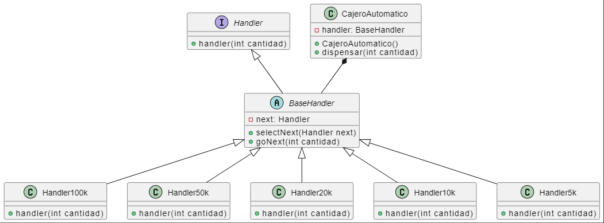

# Taller de Cadena de Responsabilidad en Java

Este repositorio contiene la solución a un taller práctico que aborda la implementación del patrón de Cadena de Responsabilidad en el contexto de una máquina dispensadora de un cajero automático.

## Descripción del Problema

Uno de los grandes ejemplos del patrón de Cadena de Responsabilidad se presenta en la máquina dispensadora de un cajero automático. En este taller, el problema específico a resolver es el siguiente: el usuario ingresa la cantidad de dinero que desea retirar, y la máquina debe dispensar la cantidad en términos de billetes de moneda definidos, como $100.000, $50.000, $20.000, $10.000, etc. Además, se establece la condición de que la cantidad ingresada por el usuario debe ser un múltiplo de $5.000; de lo contrario, se debe arrojar un error.

## Solución Implementada

La solución a este problema se ha implementado utilizando el patrón de Cadena de Responsabilidad en Java. La cadena de responsabilidad procesa la solicitud en el mismo orden que la siguiente tabla de denominaciones: 

| Denominación |
|--------------|
| 100.000      |
| 50.000       |
| 20.000       |
| 10.000       |
| 5.000        |

## Diagrama de clases

Cada eslabón de la cadena representa una denominación y maneja la solicitud si es capaz de hacerlo o la pasa al siguiente eslabón en la jerarquía.

## Cómo Utilizar

1. Clona este repositorio en tu máquina local.
2. Abre el proyecto en tu entorno de desarrollo Java preferido.
3. Explora el código fuente y comprende la lógica de la implementación.
4. Ejecuta la aplicación y realiza pruebas con diferentes cantidades para observar el comportamiento de la cadena de responsabilidad.
